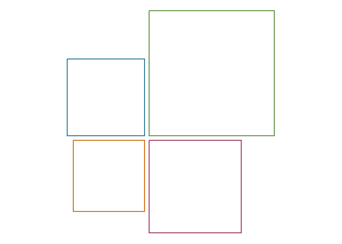
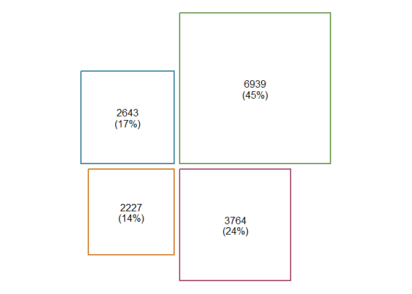
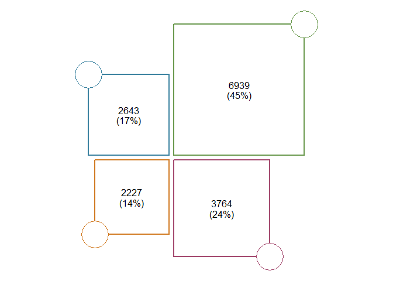
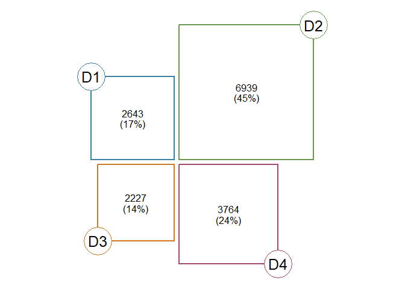
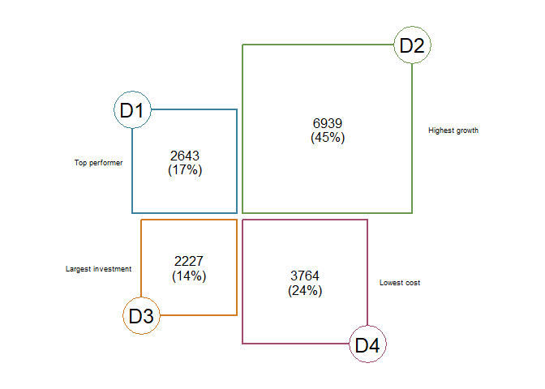

# rectangler

**rectangler** helps you build comparison-oriented rectangle graphics in
R.

It is designed for plots with a small number of meaningful objects:
domains, groups, categories, steps or indicators that should remain
directly readable.

``` r
library(rectangler)
library(dplyr)
```


## Why rectangler?

Rectangler is useful when you want to compare a small number of objects
and keep each object visually distinct.

Unlike treemaps, Rectangler does not pack everything into a single large
rectangle. It keeps the objects separate and readable.

Unlike bar charts, Rectangler does not rely on equal-width bars. It uses
rectangular layouts, labels, corner or side shapes, and annotations to
create compact comparison graphics.

The four-part layout, created with `rect_plot4()`, is especially useful
for comparing four objects in a clear visual form.

## Installation

You can install the development version from GitHub:

``` r
remotes::install_github("hriisalu/rectangler")
```

## The Rectangler grammar

Every Rectangler graphic starts with a **constructor**, which creates
the layout. Additional information is then added using **layers**.

``` r
rect_plot4(data) %>%
  rect_style() %>%
  rect_label() %>%
  rect_shape() %>%
  rect_shape_label() %>%
  rect_annotation()
```

## Your first plot

Create example data.

``` r
mydata <- tibble::tibble(
  value = c(2643, 6939, 2227, 3764),
  label = c("D1", "D2", "D3", "D4"),
  border = c("#3B82A0", "#6A994E", "#D17A22", "#A44A6F"),
  annotation = c(
    "Top performer",
    "Highest growth",
    "Largest investment",
    "Lowest cost"
  )
) %>%
  mutate(
    share = round(value / sum(value) * 100),
    text = paste0(value, "\n(", share, "%)")
  )
```

Start with a constructor.

``` r
rect_plot4(mydata, value_col = "value")
```


Add styling.

``` r
rect_plot4(mydata, value_col = "value") %>%
  rect_style(
    fill = "white",
    border_color = mydata$border,
    border_width = 2
  )
```



Add labels.

``` r
rect_plot4(mydata, value_col = "value") %>%
  rect_style(
    fill = "white",
    border_color = mydata$border,
    border_width = 2
  ) %>%
  rect_label(
    label_col = "text",
    size = 0.8
  )
```



Add corner shapes.

``` r
rect_plot4(mydata, value_col = "value") %>%
  rect_style(
    fill = "white",
    border_color = mydata$border,
    border_width = 2
  ) %>%
  rect_label(
    label_col = "text",
    size = 0.8
  ) %>%
  rect_shape(
    position = "corner",
    fill = "white",
    border_color = mydata$border,
    border_width = 1.5
  )
```



Add labels to the shapes.

``` r
rect_plot4(mydata, value_col = "value") %>%
  rect_style(
    fill = "white",
    border_color = mydata$border,
    border_width = 2
  ) %>%
  rect_label(
    label_col = "text",
    size = 0.8
  ) %>%
  rect_shape(
    position = "corner",
    fill = "white",
    border_color = mydata$border,
    border_width = 1.5
  ) %>%
  rect_shape_label(
    label_col = "label",
    size = 1.2
  )
```



Add annotations as the final layer.

``` r
rect_plot4(mydata, value_col = "value") %>%
  rect_style(
    fill = "white",
    border_color = mydata$border,
    border_width = 2
  ) %>%
  rect_label(
    label_col = "text",
    size = 0.8
  ) %>%
  rect_shape(
    position = "corner",
    fill = "white",
    border_color = mydata$border,
    border_width = 1.5
  ) %>%
  rect_shape_label(
    label_col = "label",
    size = 1.2
  ) %>%
  rect_annotation(
    label_col = "annotation",
    position = "horizontal",
    space = 1
  )
```



## Relative sizes

Many Rectangler arguments use relative sizes. The default value is
usually `1`.

Use values below `1` to make an element smaller and values above `1` to
make it larger.

``` r
rect_label(size = 0.8)
rect_shape_label(size = 1.2)
rect_annotation(space = 1.5)
```

## Other layouts

The main constructor in this README is `rect_plot4()`, but Rectangler
also includes other layouts:

``` r
rect_row(data)
rect_col(data)
rect_pyr(data)
```

See the vignette for a complete tutorial with all layouts and layers.

``` r
vignette("rectangler")
```
