# Getting started with rectangler

``` r

library(rectangler)
library(dplyr)
```

## Why rectangler?

`rectangler` is designed for comparing a small number of meaningful
objects.

These objects can be domains, groups, categories, steps, indicators or
other units that should remain directly readable.

The package is useful when you want something more diagram-like than a
bar chart, but more open and readable than a treemap.

A treemap usually packs objects inside one larger rectangle.
`rectangler` keeps the objects separate.

A bar chart usually uses equal-width bars. `rectangler` uses rectangular
layouts, labels, shapes and annotations to build compact comparison
graphics.

## Design principles

`rectangler` is based on three simple ideas:

- constructors create layouts;
- layers add information;
- visual sizes are mostly relative.

This means that you can start with a simple layout and then enrich it
step by step.

``` r

rect_plot4(data) %>%
  rect_style() %>%
  rect_label() %>%
  rect_shape() %>%
  rect_shape_label() %>%
  rect_annotation()
```

## Example data

The examples in this vignette use four fictional domains.

Each rectangle is based on a numeric value. These values determine
rectangle area: larger values create larger rectangles and smaller
values create smaller rectangles.

``` r

mydata <- tibble::tibble(
  value = c(2643, 6939, 2227, 3764),
  label = c("D1", "D2", "D3", "D4"),
  border = c("#3B82A0", "#6A994E", "#D17A22", "#A44A6F"),
  fill = c("#E7F2F7", "#EDF5E7", "#FBF0E3", "#F6E8EF"),
  shape_fill = c("#3B82A0", "#6A994E", "#D17A22", "#A44A6F"),
  annotation = c(
    "Top performer",
    "Highest growth",
    "Largest investment",
    "Lowest cost"
  )
) %>%
  mutate(
    share = round(value / sum(value) * 100),
    text = paste0(value, "\n(", share, "%)")
  )
```

## Your first plot

Every `rectangler` graphic starts with a constructor.

A constructor creates the basic rectangular layout and uses the supplied
values to determine rectangle areas.

``` r

rect_plot4(mydata, value_col = "value")
```

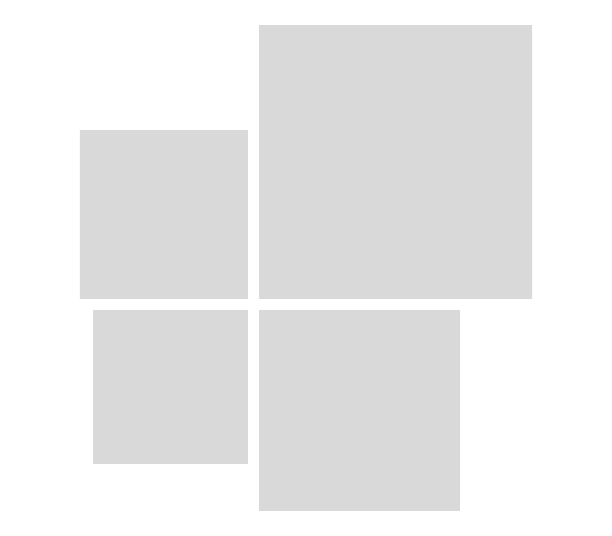

You can then add styling, labels, shapes and annotations with layers.

``` r

rect_plot4(mydata, value_col = "value") %>%
  rect_style(
    fill = "white",
    border_colour = mydata$border,
    border_width = 2
  )
```


``` r

rect_plot4(mydata, value_col = "value") %>%
  rect_style(
    fill = "white",
    border_colour = mydata$border,
    border_width = 2
  ) %>%
  rect_label(
    label_col = "text",
    size = 0.8
  )
```


``` r

rect_plot4(mydata, value_col = "value") %>%
  rect_style(
    fill = "white",
    border_colour = mydata$border,
    border_width = 2
  ) %>%
  rect_label(
    label_col = "text",
    size = 0.8
  ) %>%
  rect_shape(
    position = "corner",
    fill = "white",
    border_colour = mydata$border,
    border_width = 1.5
  ) %>%
  rect_shape_label(
    label_col = "label",
    size = 1.2
  )
```


``` r

rect_plot4(mydata, value_col = "value") %>%
  rect_style(
    fill = "white",
    border_colour = mydata$border,
    border_width = 2
  ) %>%
  rect_label(
    label_col = "text",
    size = 0.8
  ) %>%
  rect_shape(
    position = "corner",
    fill = "white",
    border_colour = mydata$border,
    border_width = 1.5
  ) %>%
  rect_shape_label(
    label_col = "label",
    size = 1.2
  ) %>%
  rect_annotation(
    label_col = "annotation",
    position = "horizontal",
    space = 1
  )
```

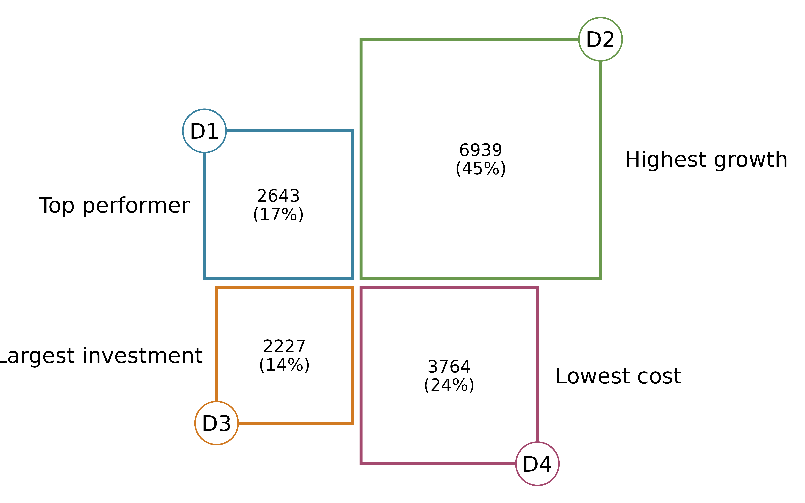

The same grammar is used throughout the package:

``` r

constructor(data) %>%
  layer() %>%
  layer() %>%
  layer()
```

## Creating layouts

Constructors create the initial layout. They do not add labels or
styling.

[`rect_plot4()`](https://hriisalu.github.io/rectangler/reference/rect_plot4.md)
always creates four rectangles.
[`rect_row()`](https://hriisalu.github.io/rectangler/reference/rect_row.md),
[`rect_col()`](https://hriisalu.github.io/rectangler/reference/rect_col.md)
and
[`rect_pyr()`](https://hriisalu.github.io/rectangler/reference/rect_pyr.md)
can create any number of rectangles.

``` r

rect_plot4(data, value_col = "value")
rect_row(data, value_col = "value")
rect_col(data, value_col = "value")
rect_pyr(data, value_col = "value")

rect_plot4(value = c(10, 20, 30, 40))
rect_row(value = c(10, 20, 30))
rect_col(value = c(10, 20, 30))
rect_pyr(value = c(10, 20, 30))
```

### Four-part layout

[`rect_plot4()`](https://hriisalu.github.io/rectangler/reference/rect_plot4.md)
creates a four-part comparison layout.

It is useful when you want to compare exactly four objects.

``` r

rect_plot4(mydata, value_col = "value") %>%
  rect_style(
    fill_col = "fill",
    border_colour_col = "border",
    border_width = 2
  ) %>%
  rect_label(label_col = "label")
```

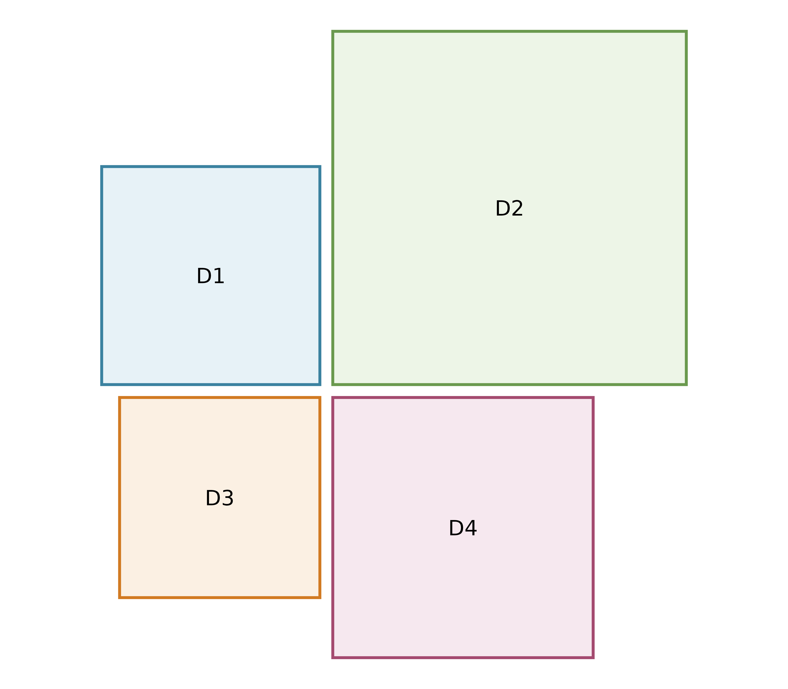

### Row layout

[`rect_row()`](https://hriisalu.github.io/rectangler/reference/rect_row.md)
arranges rectangles in a row.

``` r

rect_row(mydata, value_col = "value") %>%
  rect_style(
    fill_col = "fill",
    border_colour_col = "border",
    border_width = 2
  ) %>%
  rect_label(label_col = "label")
```

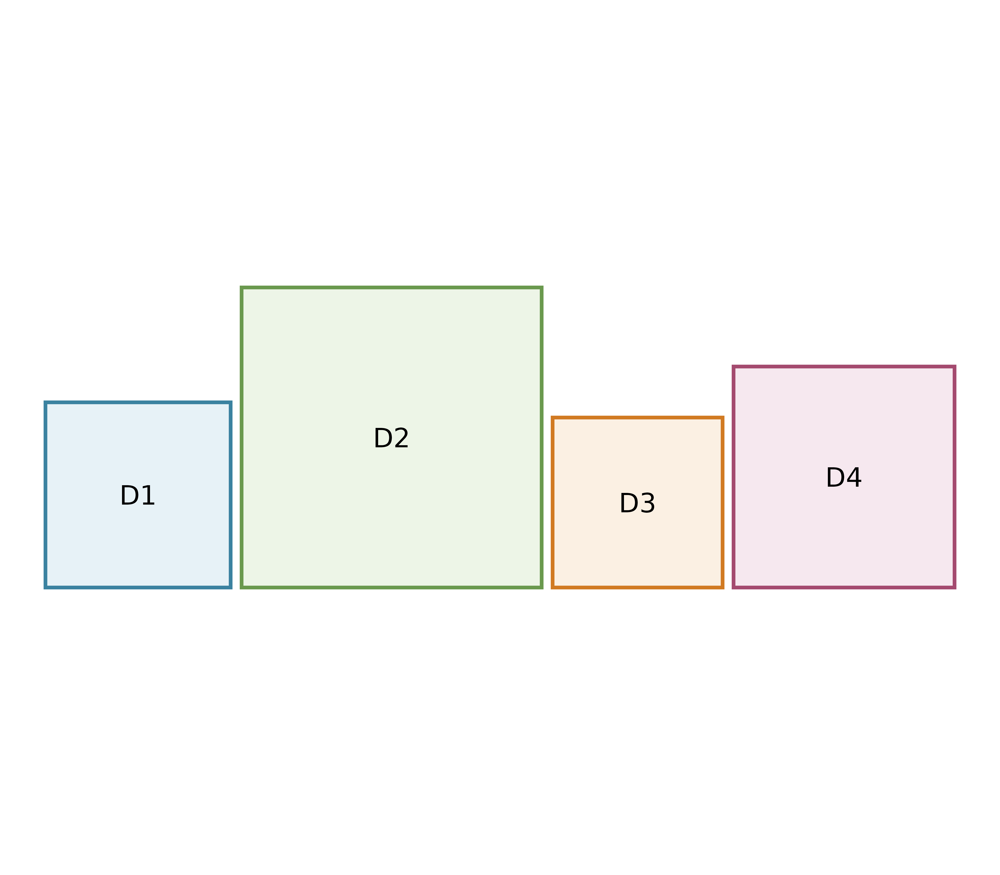

### Column layout

[`rect_col()`](https://hriisalu.github.io/rectangler/reference/rect_col.md)
arranges rectangles in a column.

``` r

rect_col(mydata, value_col = "value") %>%
  rect_style(
    fill_col = "fill",
    border_colour_col = "border",
    border_width = 2
  ) %>%
  rect_label(label_col = "label")
```

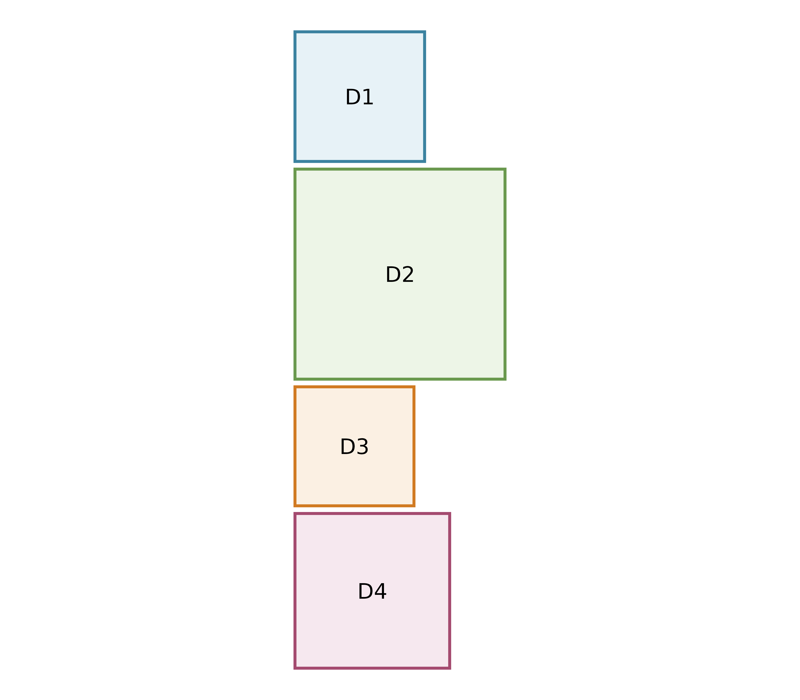

### Pyramid layout

[`rect_pyr()`](https://hriisalu.github.io/rectangler/reference/rect_pyr.md)
creates a pyramid-like layout.

``` r

pyr_data <- tibble::tibble(
  value = c(4, 3, 2, 1),
  label = c("Foundation", "Development", "Focus", "Goal"),
  fill = c("#E7F2F7", "#EDF5E7", "#FBF0E3", "#F6E8EF"),
  border = c("#3B82A0", "#6A994E", "#D17A22", "#A44A6F")
)

rect_pyr(pyr_data, value_col = "value") %>%
  rect_style(
    fill_col = "fill",
    border_colour_col = "border",
    border_width = 2
  ) %>%
  rect_label(
    label_col = "label",
    size = 0.8
  )
```

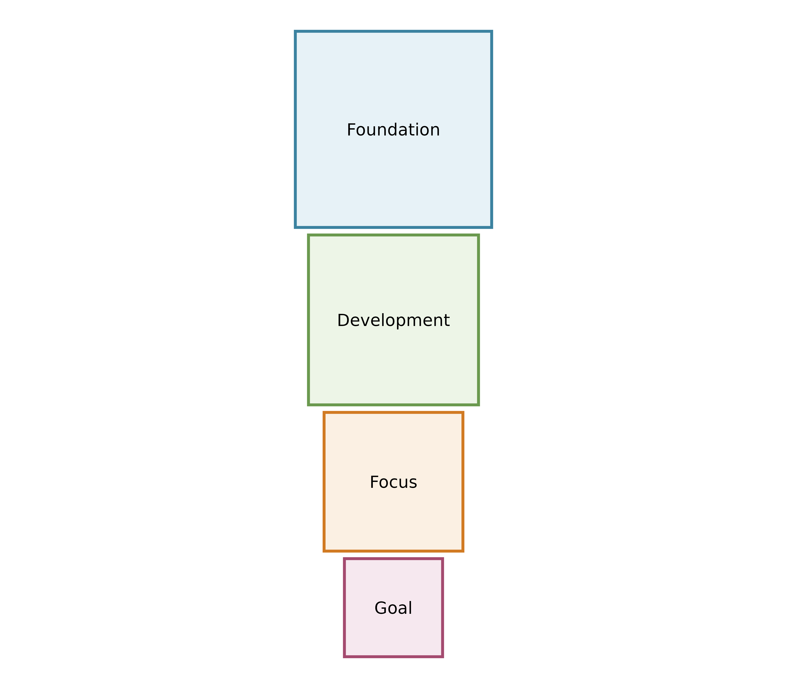

The constructors determine how many rectangles are created and how their
areas are sized. The next section explains how values are supplied to
constructors and layers.

## Supplying values

Most `rectangler` arguments can be supplied in three ways:

- one value → used for every rectangle;
- a vector → one value for each rectangle;
- a data column → one value for each rectangle.

A direct value must have either length 1 or one value for every
rectangle; otherwise `rectangler` returns an error.

The `data` argument can still be used together with a direct `value`
vector. In that case, `data` provides labels, colours or other layer
settings, while `value` determines rectangle areas.

Do not supply `value` and `value_col` at the same time.

For
[`rect_row()`](https://hriisalu.github.io/rectangler/reference/rect_row.md),
[`rect_col()`](https://hriisalu.github.io/rectangler/reference/rect_col.md)
and
[`rect_pyr()`](https://hriisalu.github.io/rectangler/reference/rect_pyr.md),
the number of rectangles is determined by the number of rows in `data`
or, when no data is supplied, by the length of `value`.
[`rect_plot4()`](https://hriisalu.github.io/rectangler/reference/rect_plot4.md)
always creates four rectangles.

This number also determines how many values vector-based layer arguments
must contain.

### One value for all rectangles

A single value is used for every rectangle.

``` r

rect_plot4(mydata, value_col = "value") %>%
  rect_style(
    fill = "white",
    border_colour = "#3B82A0",
    border_width = 2
  ) %>%
  rect_label(
    label_col = "label",
    colour = "black"
  )
```


### A vector with one value per rectangle

A vector supplies one value for each rectangle.

``` r

rect_plot4(mydata, value_col = "value") %>%
  rect_style(
    fill = c("#E7F2F7", "#EDF5E7", "#FBF0E3", "#F6E8EF"),
    border_colour = c("#3B82A0", "#6A994E", "#D17A22", "#A44A6F"),
    border_width = c(1, 2, 3, 4)
  ) %>%
  rect_label(
    label = c("A", "B", "C", "D"),
    size = c(0.8, 1, 1.2, 1.4)
  )
```


### A column from the data

Column arguments usually end with `_col`.

They take the name of a column as a string. This is useful when the data
itself contains labels, colours, sizes or other visual settings, for
example inside a function or a Shiny app.

``` r

rect_plot4(mydata, value_col = "value") %>%
  rect_style(
    fill_col = "fill",
    border_colour_col = "border",
    border_width = 2
  ) %>%
  rect_label(
    label_col = "text"
  ) %>%
  rect_shape(
    position = "corner",
    fill_col = "shape_fill",
    border_colour = "white"
  ) %>%
  rect_shape_label(
    label_col = "label",
    colour = "white"
  )
```

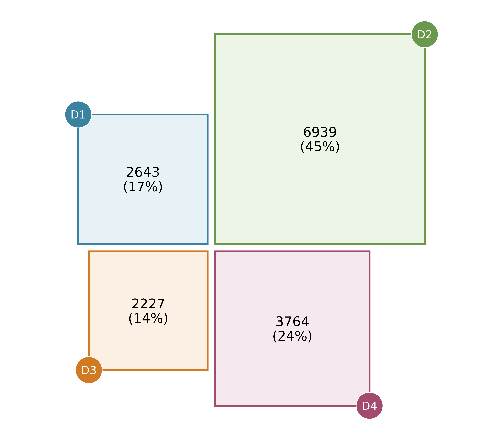

## Styling rectangles

[`rect_style()`](https://hriisalu.github.io/rectangler/reference/rect_style.md)
controls rectangle fill, border colour, border width, border type and
transparency.

These settings can be supplied as a single value, a vector or from data
columns, using the rules described above.

``` r

rect_plot4(mydata, value_col = "value") %>%
  rect_style(
    fill_col = "fill",
    border_colour_col = "border",
    border_width = 2
  )
```


## Working with labels

[`rect_label()`](https://hriisalu.github.io/rectangler/reference/rect_label.md)
adds text inside rectangles.

Labels can be supplied directly with `label` or read from a data column
with `label_col`. Their appearance can be adjusted with arguments such
as `size`, `colour`, `family` and `fontface`.

``` r

rect_plot4(mydata, value_col = "value") %>%
  rect_style(
    fill = "white",
    border_colour_col = "border",
    border_width = 2
  ) %>%
  rect_label(label_col = "text")
```

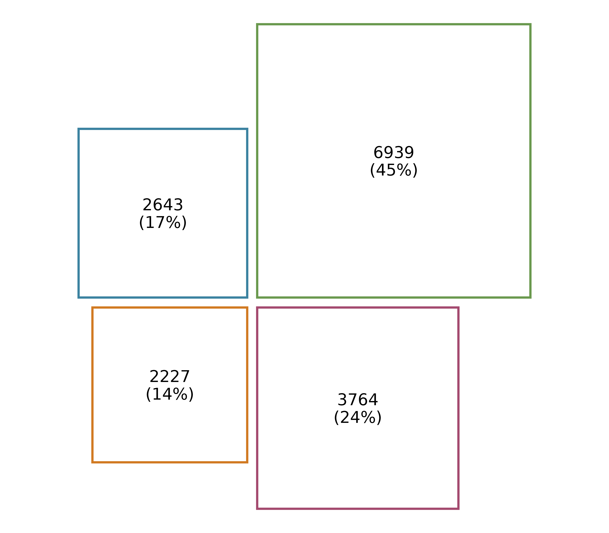

## Adding shapes

[`rect_shape()`](https://hriisalu.github.io/rectangler/reference/rect_shape.md)
adds small shapes to rectangles.

Shapes can be used as markers, category badges or visual anchors. Their
appearance can be controlled with arguments such as `fill`,
`border_colour` and `border_width`.

``` r

rect_plot4(mydata, value_col = "value") %>%
  rect_style(
    fill = "white",
    border_colour_col = "border",
    border_width = 2
  ) %>%
  rect_shape(
    position = "corner",
    fill_col = "shape_fill",
    border_colour = "white",
    border_width = 1
  )
```

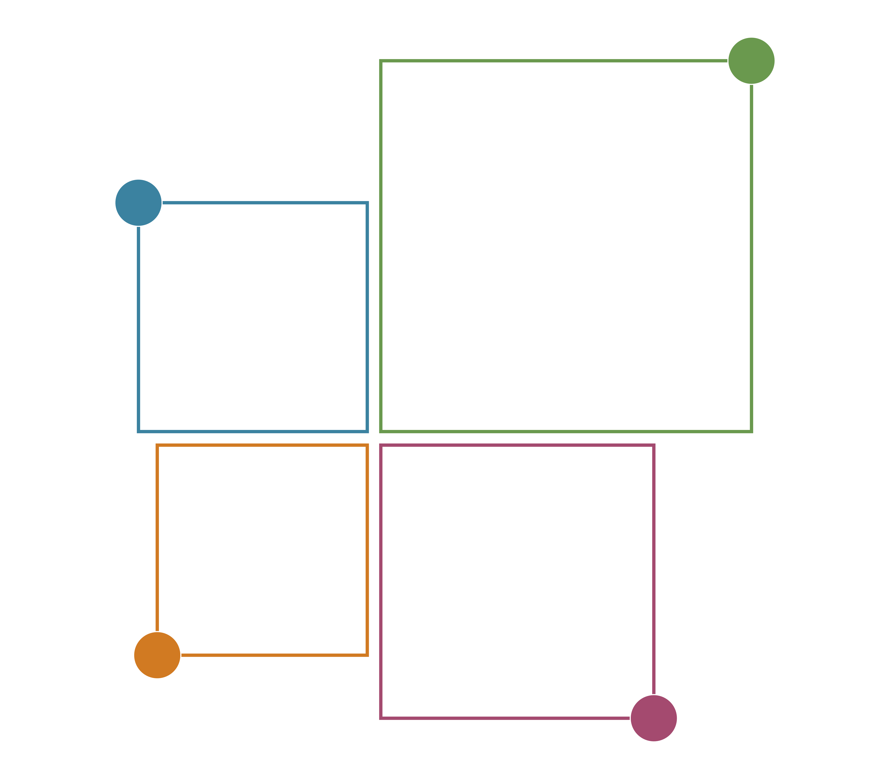

### Shape labels

[`rect_shape_label()`](https://hriisalu.github.io/rectangler/reference/rect_shape_label.md)
adds text to these shapes. Label appearance can be controlled with
arguments such as `size`, `colour` and `fontface`.

``` r

rect_plot4(mydata, value_col = "value") %>%
  rect_style(
    fill = "white",
    border_colour_col = "border",
    border_width = 2
  ) %>%
  rect_shape(
    position = "corner",
    fill_col = "shape_fill",
    border_colour = "white",
    border_width = 1
  ) %>%
  rect_shape_label(
    label_col = "label",
    colour = "white",
    size = 1.1
  )
```

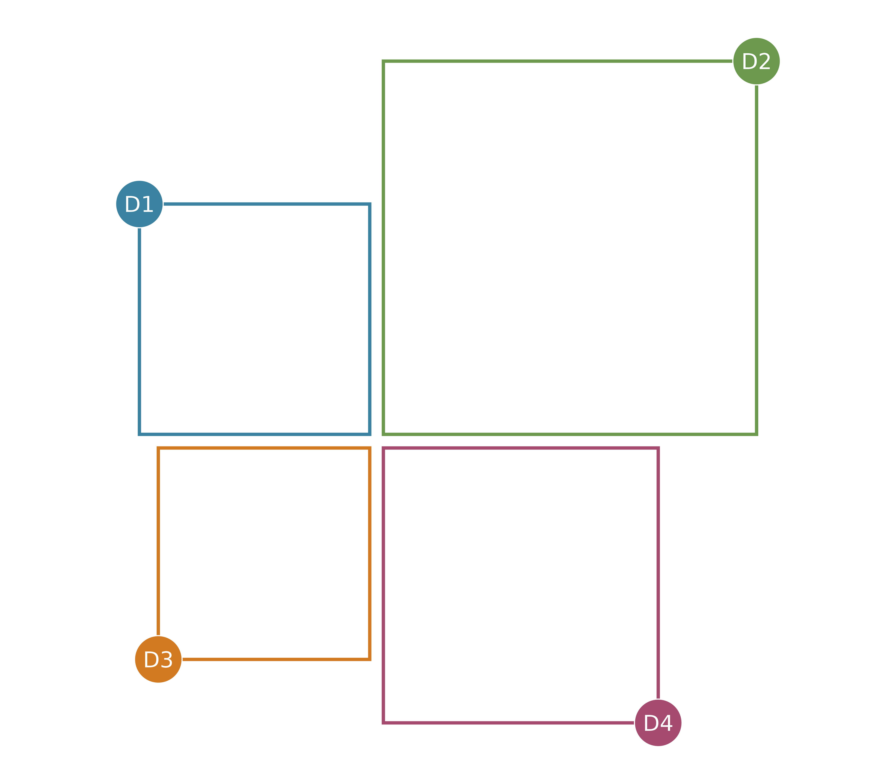

### Shape positions

Shape positions can be adjusted with the `position` argument.

Available positions include `"corner"`, `"top-left"`, `"top-right"`,
`"bottom-left"`, `"bottom-right"`, `"left"`, `"right"`, `"top"` and
`"bottom"`.

For
[`rect_plot4()`](https://hriisalu.github.io/rectangler/reference/rect_plot4.md),
shapes can also alternate between sides using `"left-right"` or
`"top-bottom"`.

The examples below compare `"corner"` and `"top-bottom"`.

``` r

rect_plot4(mydata, value_col = "value") %>%
  rect_style(
    fill = "white",
    border_colour_col = "border",
    border_width = 2
  ) %>%
  rect_shape(
    position = "corner",
    fill_col = "shape_fill",
    border_colour = "white",
    border_width = 1
  ) %>%
  rect_shape_label(
    label_col = "label",
    colour = "white",
    size = 1.1
  )

rect_plot4(mydata, value_col = "value") %>%
  rect_style(
    fill = "white",
    border_colour_col = "border",
    border_width = 2
  ) %>%
  rect_shape(
    position = "top-bottom",
    fill_col = "shape_fill",
    border_colour = "white",
    border_width = 1
  ) %>%
  rect_shape_label(
    position = "top-bottom",
    label_col = "label",
    colour = "white",
    size = 1.1
  )
```

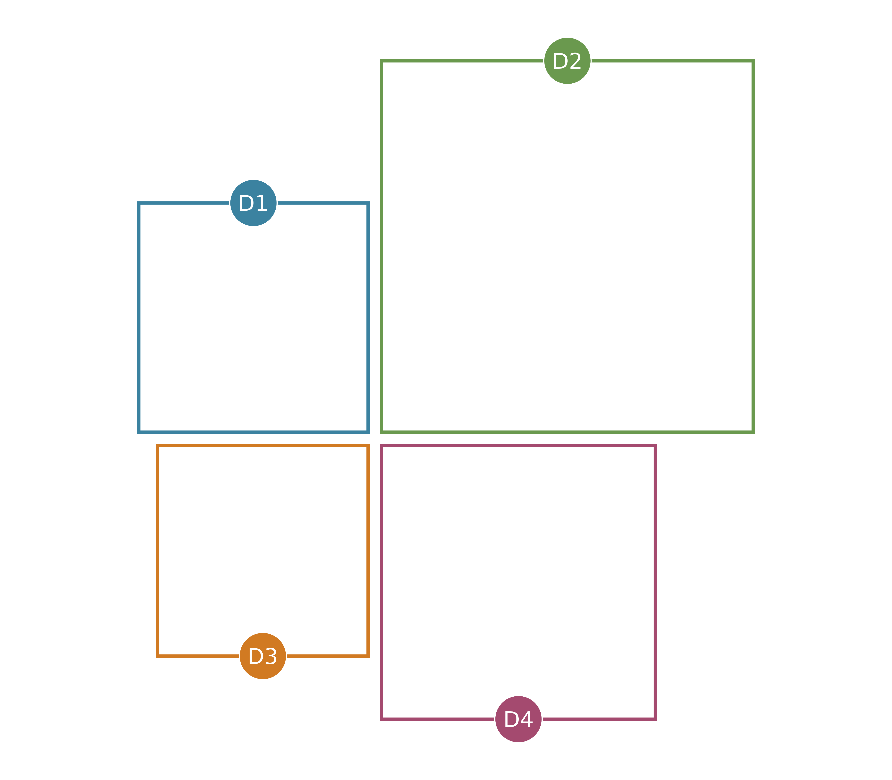

### Shape offsets

Offsets move shapes without changing the rectangles. Use `offset_x` and
`offset_y` to fine-tune their horizontal and vertical position.

``` r

rect_plot4(mydata, value_col = "value") %>%
  rect_style(
    fill = "white",
    border_colour_col = "border",
    border_width = 2
  ) %>%
  rect_shape(
    position = "corner",
    offset_x = 0,
    offset_y = 0,
    fill_col = "shape_fill",
    border_colour = "white"
  )

rect_plot4(mydata, value_col = "value") %>%
  rect_style(
    fill = "white",
    border_colour_col = "border",
    border_width = 2
  ) %>%
  rect_shape(
    position = "corner",
    offset_x = 0.4,
    offset_y = 0.4,
    fill_col = "shape_fill",
    border_colour = "white"
  )
```

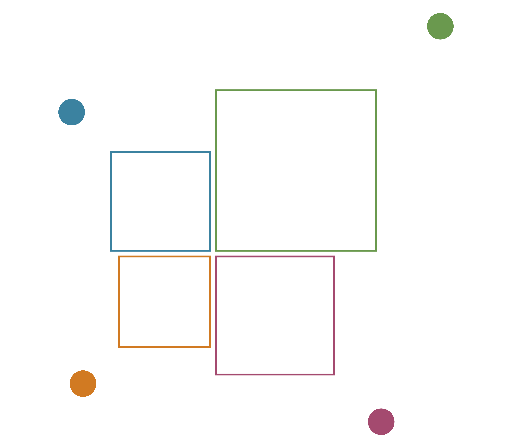

### Shape types

The `shape` argument controls the symbol used by
[`rect_shape()`](https://hriisalu.github.io/rectangler/reference/rect_shape.md).

Rectangler uses the same shape values as
[`ggplot2::geom_point()`](https://ggplot2.tidyverse.org/reference/geom_point.html).
For example:

- `21` = circle
- `22` = square
- `23` = diamond
- `24` = triangle up
- `25` = triangle down

``` r

rect_plot4(mydata, value_col = "value") %>%
  rect_style(
    fill = "white",
    border_colour_col = "border",
    border_width = 2
  ) %>%
  rect_label(label_col = "label") %>%
  rect_shape(
    shape = 23,
    fill = "white",
    border_colour_col = "border",
    border_width = 1.5
  ) %>%
  rect_shape_label(
    label_col = "label",
    colour_col = "border"
  )

rect_plot4(mydata, value_col = "value") %>%
  rect_style(
    fill = "white",
    border_colour_col = "border",
    border_width = 2
  ) %>%
  rect_label(label_col = "label") %>%
  rect_shape(
    shape = 24,
    fill = "#E3A857",
    border_colour = "#8C5A2B",
    border_width = 1.5
  ) %>%
  rect_shape_label(
    label_col = "label",
    colour = "white"
  )
```

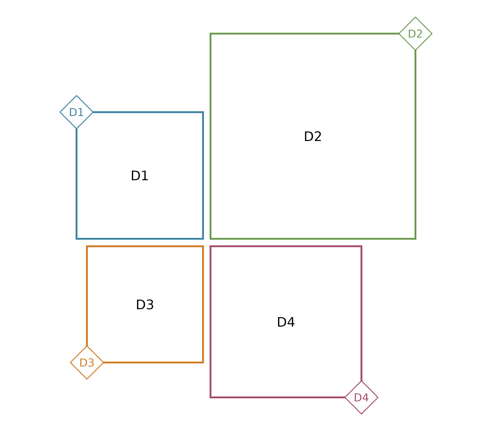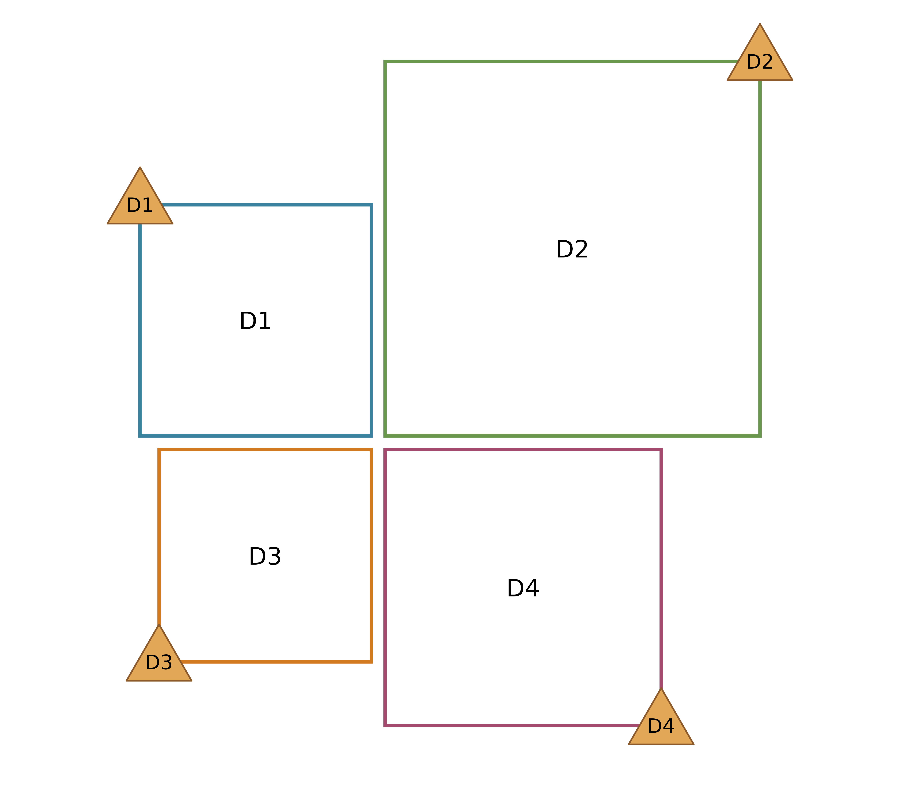

## Using annotations

[`rect_annotation()`](https://hriisalu.github.io/rectangler/reference/rect_annotation.md)
adds comments around the layout.

Annotations are useful when the plot should explain why each rectangle
matters. They can be supplied directly or from a data column, and the
available `position` values depend on the layout type.

``` r

rect_plot4(mydata, value_col = "value") %>%
  rect_style(
    fill = "white",
    border_colour_col = "border",
    border_width = 2
  ) %>%
  rect_label(
    label_col = "label",
    size = 1
  ) %>%
  rect_annotation(
    label_col = "annotation",
    position = "horizontal",
    space = 1
  )
```

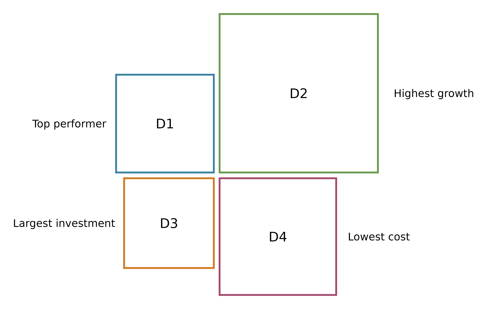

Annotation positions also accept intuitive aliases. For example,
`position = "horizontal"` and `position = "h"` mean the same thing.

``` r

rect_annotation(position = "horizontal")
rect_annotation(position = "h")
```

## Controlling size, spacing and proportions

Many visual arguments in `rectangler` use relative sizes.

A value of `1` usually means the default size. Values below `1` make an
element smaller, while values above `1` make it larger.

### Label size

`size` controls label size relative to the default text size.

``` r

rect_plot4(mydata, value_col = "value") %>%
  rect_style(
    fill = "white",
    border_colour_col = "border",
    border_width = 2
  ) %>%
  rect_label(
    label_col = "label",
    size = 0.7
  )

rect_plot4(mydata, value_col = "value") %>%
  rect_style(
    fill = "white",
    border_colour_col = "border",
    border_width = 2
  ) %>%
  rect_label(
    label_col = "label",
    size = 1.4
  )
```


### Shape size

`size` controls shape size relative to the default shape size.

``` r

rect_plot4(mydata, value_col = "value") %>%
  rect_style(
    fill = "white",
    border_colour_col = "border",
    border_width = 2
  ) %>%
  rect_shape(
    position = "corner",
    size = 1,
    fill_col = "shape_fill",
    border_colour = "white"
  )

rect_plot4(mydata, value_col = "value") %>%
  rect_style(
    fill = "white",
    border_colour_col = "border",
    border_width = 2
  ) %>%
  rect_shape(
    position = "corner",
    size = 2.5,
    fill_col = "shape_fill",
    border_colour = "white"
  )
```

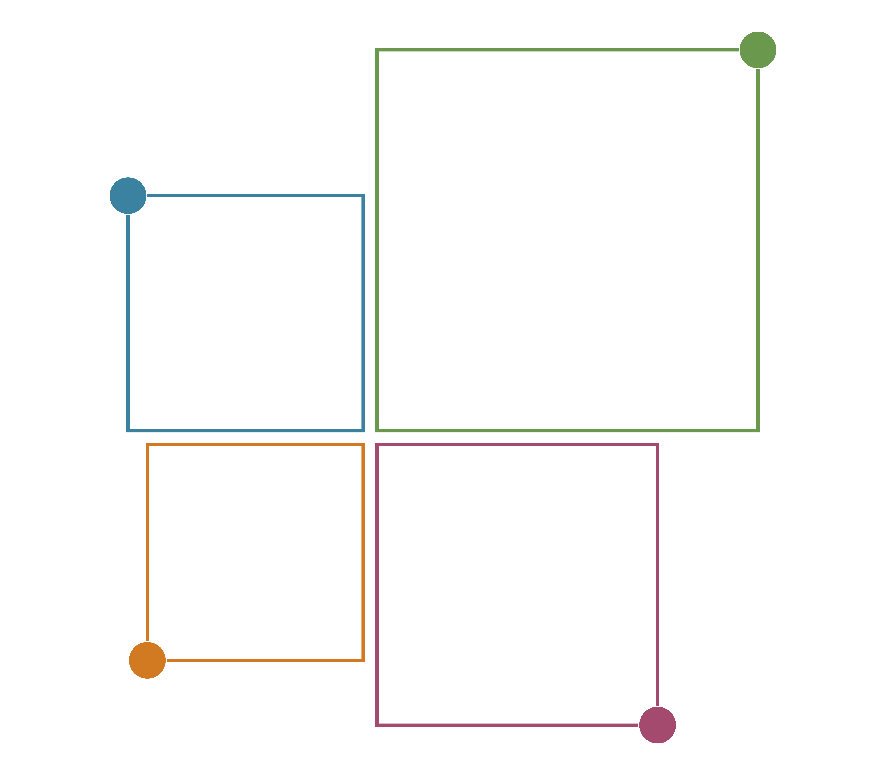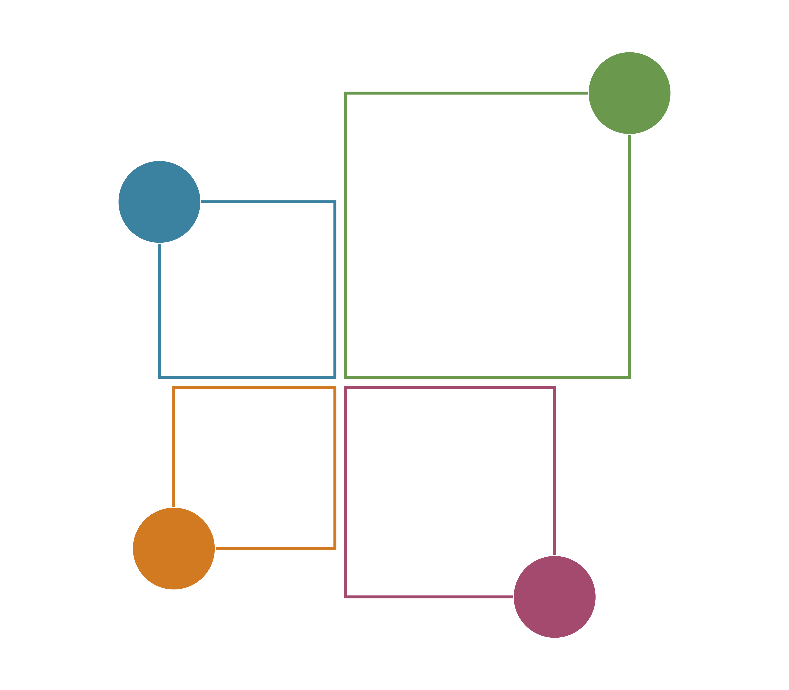

### Annotation space

`space` controls how much room is reserved around the plot for
annotations.

For short annotations, a small amount of extra space may be enough.
Longer annotation text may need more room. Increasing `space` expands
the plotting area around the rectangles so that the text fits without
being clipped.

``` r

rect_plot4(mydata, value_col = "value") %>%
  rect_style(
    fill = "white",
    border_colour_col = "border",
    border_width = 2
  ) %>%
  rect_label(label_col = "label") %>%
  rect_annotation(
    label_col = "annotation",
    position = "horizontal",
    space = 1.2
  )
```

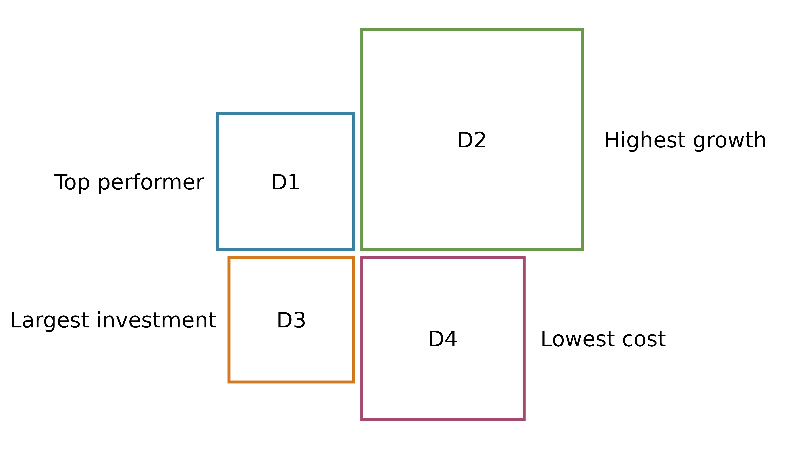

``` r


mydata_space <- mydata %>%
  mutate(
    annotation = c(
      "Top performer in the latest year",
      "Highest growth compared\nwith the previous baseline year",
      "Largest investment among all domains",
      "Lowest cost per completed activity"
    )
  )

rect_plot4(mydata_space, value_col = "value") %>%
  rect_style(
    fill = "white",
    border_colour_col = "border",
    border_width = 2
  ) %>%
  rect_label(label_col = "label") %>%
  rect_annotation(
    label_col = "annotation",
    position = "horizontal",
    space = 4,
    size = 0.8
  )
```


### Gap

`gap` controls the space between rectangles in the constructor.

``` r

rect_plot4(mydata, value_col = "value", gap = 0.02) %>%
  rect_style(
    fill = "white",
    border_colour_col = "border",
    border_width = 2
  ) %>%
  rect_label(label_col = "label")

rect_plot4(mydata, value_col = "value", gap = 0.15) %>%
  rect_style(
    fill = "white",
    border_colour_col = "border",
    border_width = 2
  ) %>%
  rect_label(label_col = "label")
```

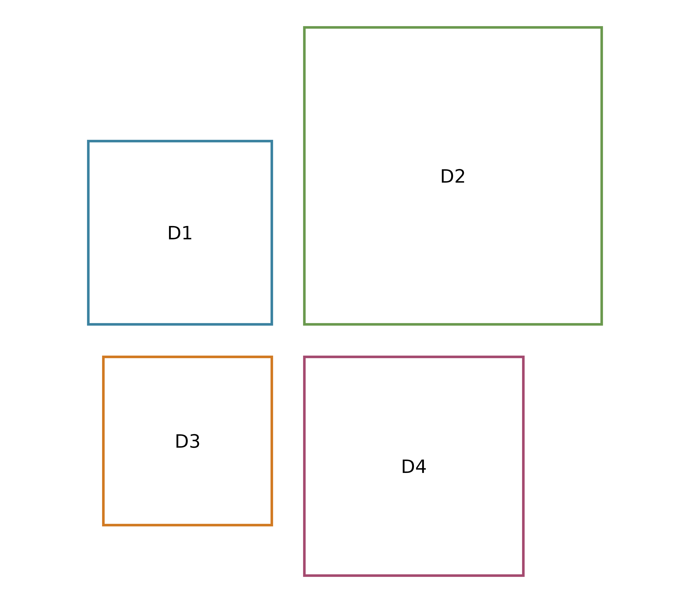

### Padding

`padding` controls the space between the plot and the outer plotting
area.

``` r

rect_plot4(mydata, value_col = "value", padding = 0.02) %>%
  rect_style(
    fill = "white",
    border_colour_col = "border",
    border_width = 2
  ) %>%
  rect_label(label_col = "label")

rect_plot4(mydata, value_col = "value", padding = 0.20) %>%
  rect_style(
    fill = "white",
    border_colour_col = "border",
    border_width = 2
  ) %>%
  rect_label(label_col = "label")
```

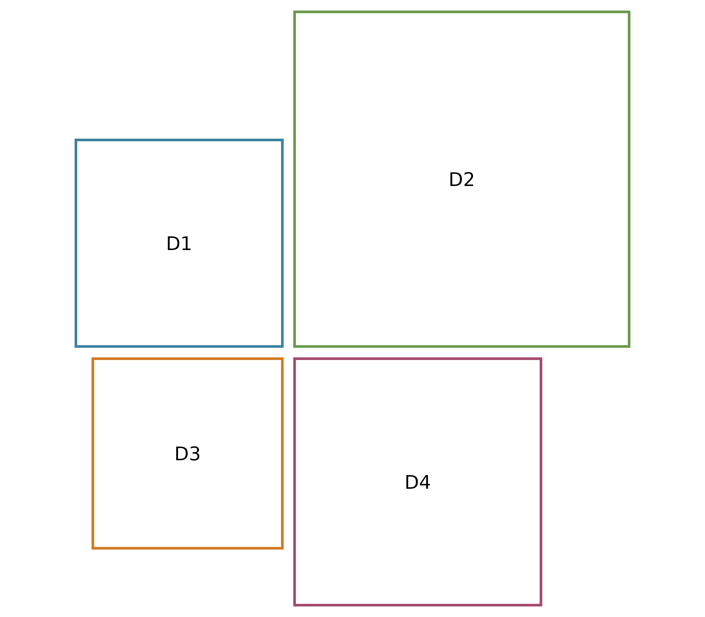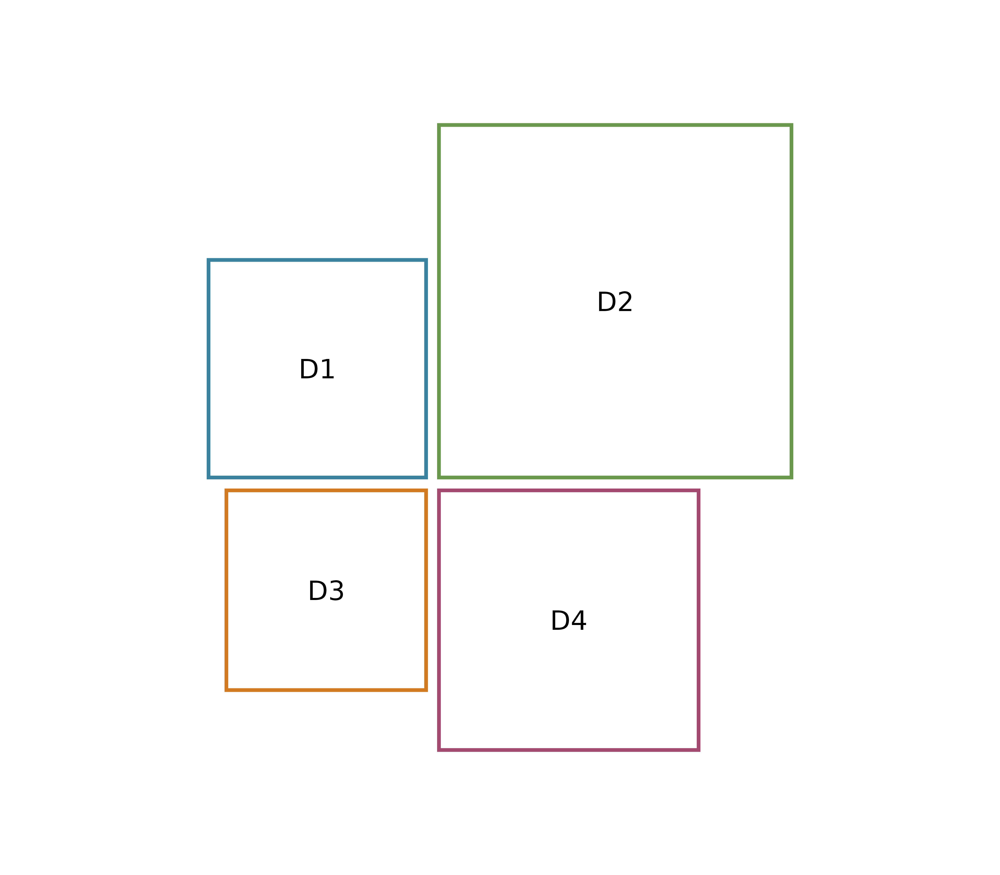

### Aspect ratio

`aspect_ratio` controls the shape of the rectangles.

``` r

rect_row(mydata, value_col = "value", aspect_ratio = "square") %>%
  rect_style(
    fill = "white",
    border_colour_col = "border",
    border_width = 2
  ) %>%
  rect_label(label_col = "label")

rect_row(mydata, value_col = "value", aspect_ratio = "1:2") %>%
  rect_style(
    fill = "white",
    border_colour_col = "border",
    border_width = 2
  ) %>%
  rect_label(label_col = "label")
```

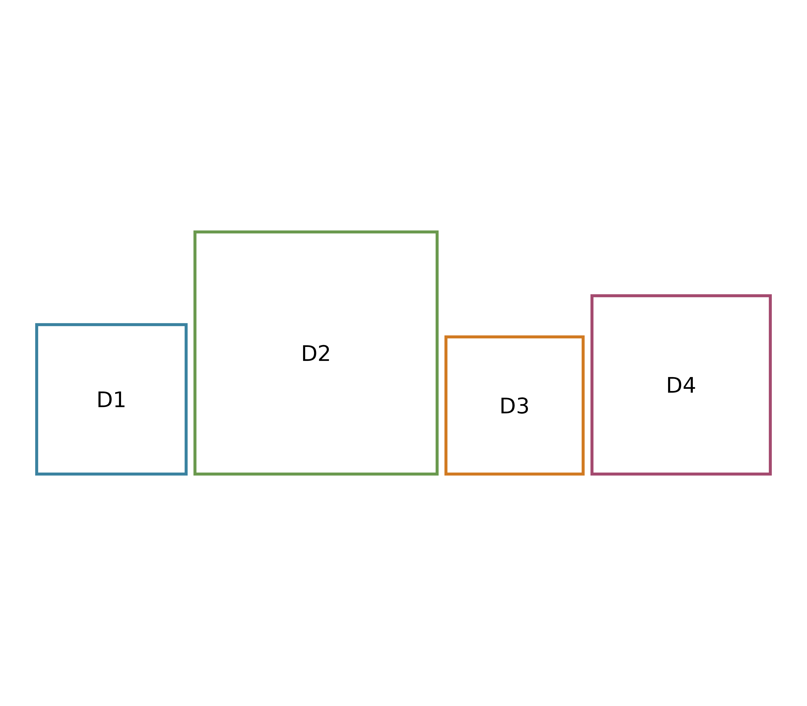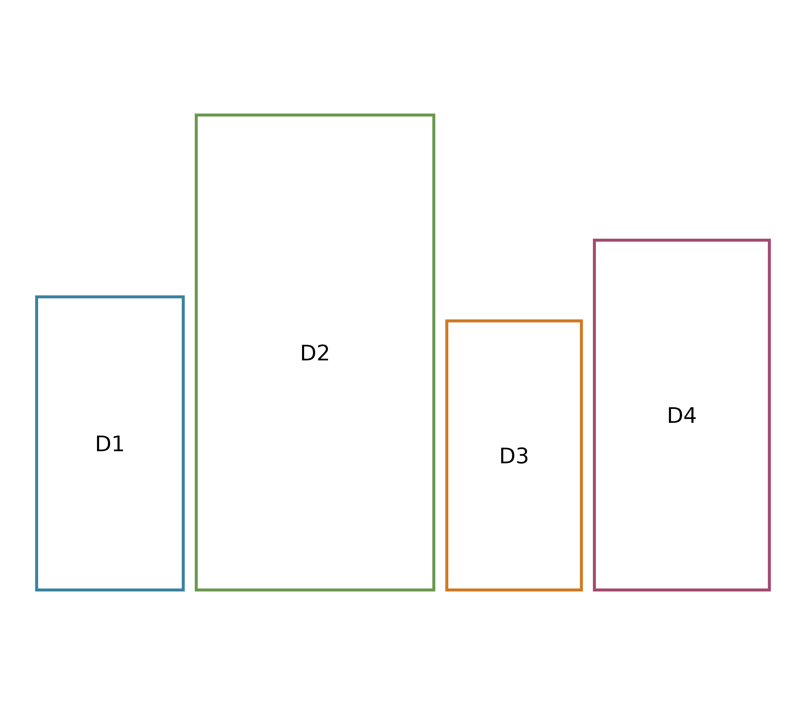

## Complete examples

This section shows a few complete examples for different tasks.

### Simple comparison

``` r

rect_row(mydata, value_col = "value") %>%
  rect_style(
    fill_col = "fill",
    border_colour_col = "border",
    border_width = 2
  ) %>%
  rect_label(
    label_col = "text",
    size = 0.8
  )
```


### Comparison with labeled shapes

``` r

rect_plot4(mydata, value_col = "value") %>%
  rect_style(
    fill = "white",
    border_colour_col = "border",
    border_width = 2
  ) %>%
  rect_shape(
    position = "corner",
    shape = 23,
    size = 4,
    fill_col = "shape_fill",
    border_colour = "white"
  ) %>%
  rect_shape_label(
    label_col = "label",
    colour = "white",
    size = 1
  ) %>%
  rect_label(
    label_col = "text",
    size = 0.8
  )
```

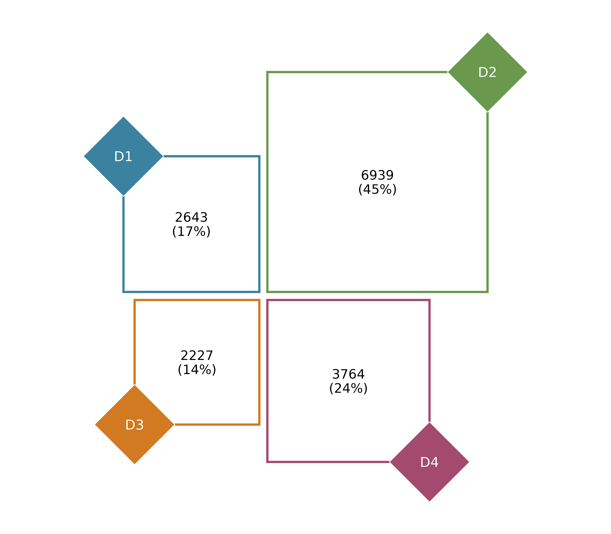

### Annotated comparison

``` r

rect_col(mydata, value_col = "value") %>%
  rect_style(
    fill_col = "fill",
    border_colour_col = "border",
    border_width = 2
  ) %>%
  rect_label(
    label_col = "text",
    size = 0.8
  ) %>%
  rect_annotation(
    label_col = "annotation",
    position = "right",
    space = 1.2
  )
```

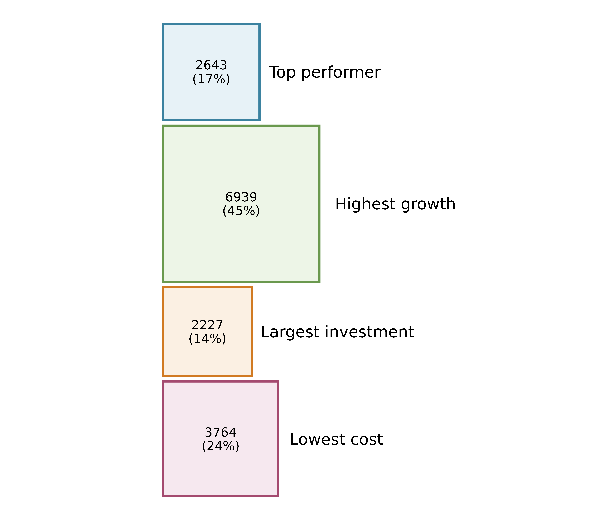

## Using rectangler in Shiny

`rectangler` plots can be used in Shiny with `renderPlot()`.

A Shiny app can keep labels, colours and annotations in the data and
pass them to `rectangler` through `_col` arguments.

``` r

output$rectangler_plot <- shiny::renderPlot({
  rect_plot4(mydata, value_col = "value") %>%
    rect_style(
      fill_col = "fill",
      border_colour_col = "border",
      border_width = 2
    ) %>%
    rect_label(
      label_col = "text",
      size = 0.8
    )
})
```

## Summary

`rectangler` is useful when you want to compare a small number of
objects with a clear visual structure.

Start with a constructor. Add style, labels, shapes and annotations as
needed.

Supply settings as a single value, one value per rectangle or from a
data column. For direct vectors, use either one value or exactly one
value per rectangle. For arguments with a `*_col` version, supply either
the direct value or the column name, not both.
