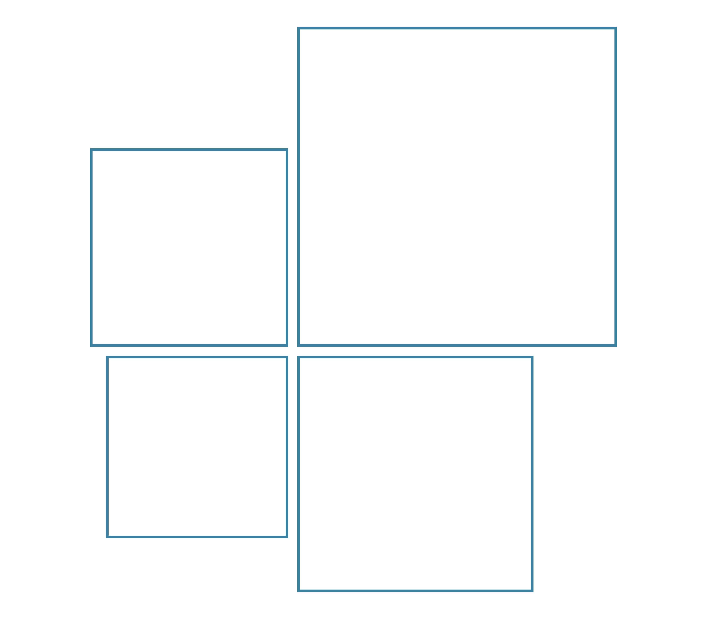
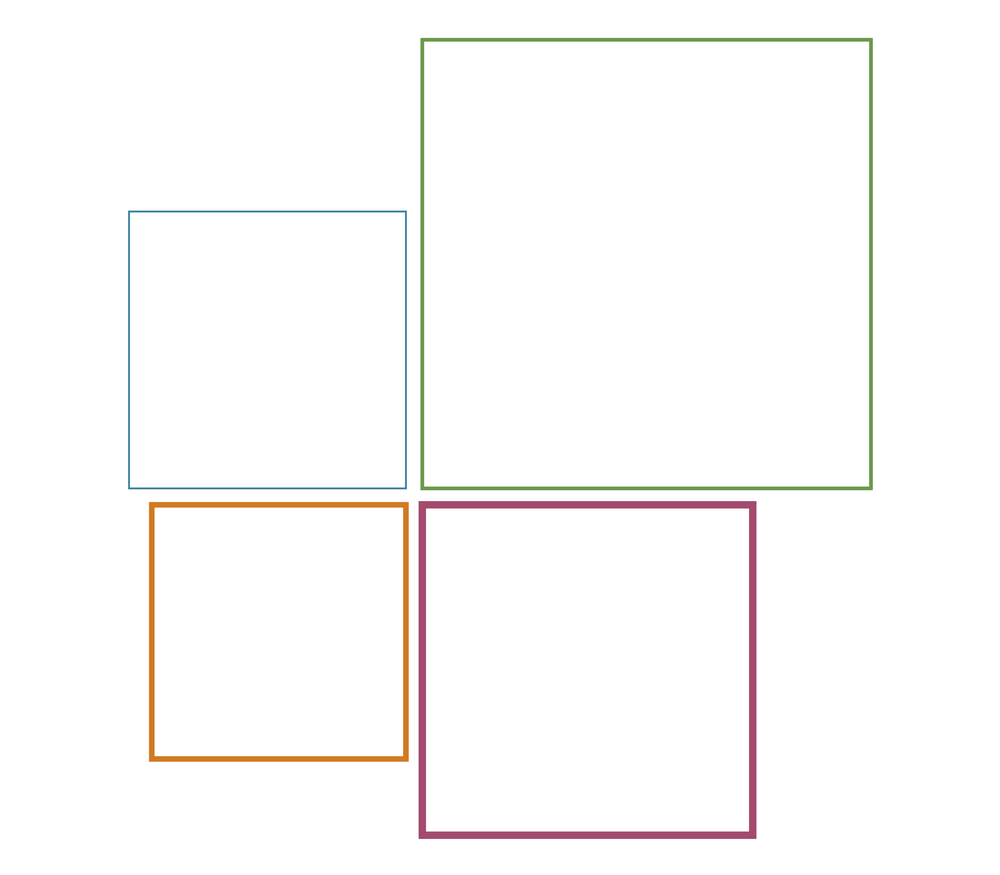
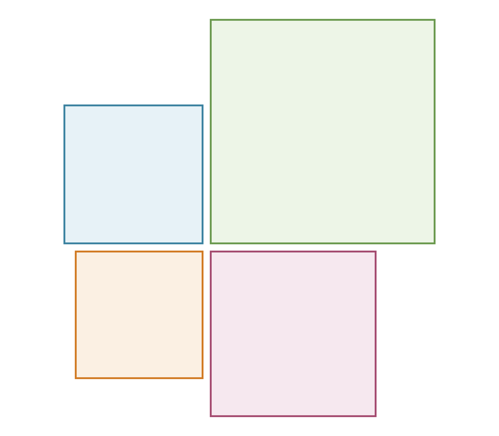
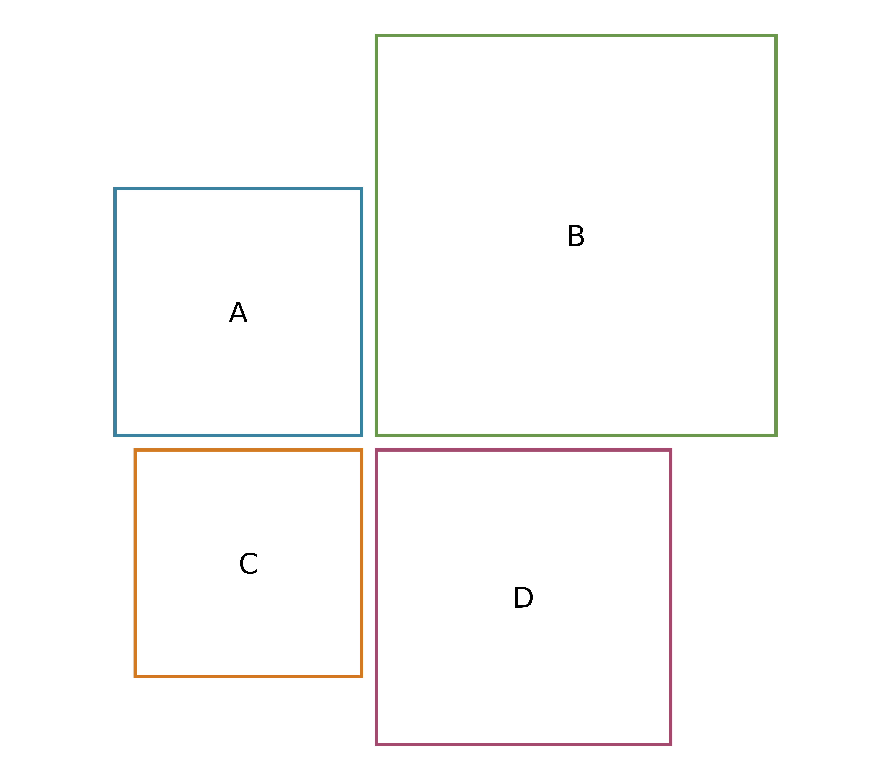
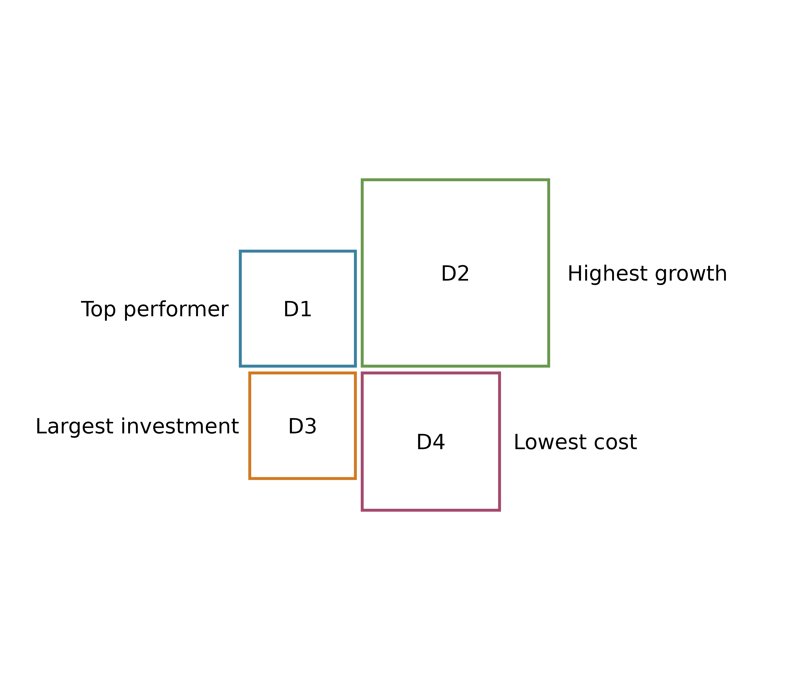

# Getting started with rectangler

``` r

library(rectangler)
library(dplyr)
```

## Why rectangler?

`rectangler` is designed for comparing a small number of meaningful
objects.

These objects can be domains, groups, categories, steps, indicators or
other units that should remain directly readable.

The package is useful when you want something more diagram-like than a
bar chart, but more open and readable than a treemap.

A treemap usually packs objects inside one larger rectangle.
`rectangler` keeps the objects separate.

A bar chart usually uses equal-width bars. `rectangler` uses rectangular
layouts, labels, shapes and annotations to build compact comparison
graphics.

## Design principles

`rectangler` is based on three simple ideas:

- constructors create layouts;
- layers add information;
- visual sizes are mostly relative.

This means that you can start with a simple layout and then enrich it
step by step.

``` r

rect_plot4(data) %>%
  rect_style() %>%
  rect_label() %>%
  rect_shape() %>%
  rect_shape_label() %>%
  rect_annotation()
```

## Example data

The examples in this vignette use four fictional domains.

``` r

mydata <- tibble::tibble(
  value = c(2643, 6939, 2227, 3764),
  label = c("D1", "D2", "D3", "D4"),
  border = c("#3B82A0", "#6A994E", "#D17A22", "#A44A6F"),
  fill = c("#E7F2F7", "#EDF5E7", "#FBF0E3", "#F6E8EF"),
  shape_fill = c("#3B82A0", "#6A994E", "#D17A22", "#A44A6F"),
  annotation = c(
    "Top performer",
    "Highest growth",
    "Largest investment",
    "Lowest cost"
  )
) %>%
  mutate(
    share = round(value / sum(value) * 100),
    text = paste0(value, "\n(", share, "%)")
  )
```

## Your first plot

Every `rectangler` graphic starts with a constructor.

A constructor creates the basic rectangular layout.

``` r

rect_plot4(mydata, value_col = "value")
```


Layers then add styling, labels, shapes and annotations.

``` r

rect_plot4(mydata, value_col = "value") %>%
  rect_style(
    fill = "white",
    border_colour = mydata$border,
    border_width = 2
  )
```


``` r

rect_plot4(mydata, value_col = "value") %>%
  rect_style(
    fill = "white",
    border_colour = mydata$border,
    border_width = 2
  ) %>%
  rect_label(
    label_col = "text",
    size = 0.8
  )
```


``` r

rect_plot4(mydata, value_col = "value") %>%
  rect_style(
    fill = "white",
    border_colour = mydata$border,
    border_width = 2
  ) %>%
  rect_label(
    label_col = "text",
    size = 0.8
  ) %>%
  rect_shape(
    position = "corner",
    fill = "white",
    border_colour = mydata$border,
    border_width = 1.5
  ) %>%
  rect_shape_label(
    label_col = "label",
    size = 1.2
  )
```


``` r

rect_plot4(mydata, value_col = "value") %>%
  rect_style(
    fill = "white",
    border_colour = mydata$border,
    border_width = 2
  ) %>%
  rect_label(
    label_col = "text",
    size = 0.8
  ) %>%
  rect_shape(
    position = "corner",
    fill = "white",
    border_colour = mydata$border,
    border_width = 1.5
  ) %>%
  rect_shape_label(
    label_col = "label",
    size = 1.2
  ) %>%
  rect_annotation(
    label_col = "annotation",
    position = "horizontal",
    space = 1
  )
```


The same grammar is used throughout the package:

``` r

constructor(data) %>%
  layer() %>%
  layer() %>%
  layer()
```

## Creating layouts

Constructors create the initial layout. They do not add labels or
styling.

``` r

rect_plot4(data)
rect_row(data)
rect_col(data)
rect_pyr(data)
```

### Four-part layout

[`rect_plot4()`](https://hriisalu.github.io/rectangler/reference/rect_plot4.md)
creates a four-part comparison layout.

It is useful when you want to compare exactly four objects.

``` r

rect_plot4(mydata, value_col = "value") %>%
  rect_style(
    fill_col = "fill",
    border_colour_col = "border",
    border_width = 2
  ) %>%
  rect_label(label_col = "label")
```


### Row layout

[`rect_row()`](https://hriisalu.github.io/rectangler/reference/rect_row.md)
arranges rectangles in a row.

``` r

rect_row(mydata, value_col = "value") %>%
  rect_style(
    fill_col = "fill",
    border_colour_col = "border",
    border_width = 2
  ) %>%
  rect_label(label_col = "label")
```


### Column layout

[`rect_col()`](https://hriisalu.github.io/rectangler/reference/rect_col.md)
arranges rectangles in a column.

``` r

rect_col(mydata, value_col = "value") %>%
  rect_style(
    fill_col = "fill",
    border_colour_col = "border",
    border_width = 2
  ) %>%
  rect_label(label_col = "label")
```


### Pyramid layout

[`rect_pyr()`](https://hriisalu.github.io/rectangler/reference/rect_pyr.md)
creates a pyramid-like layout.

``` r

pyr_data <- tibble::tibble(
  value = c(4, 3, 2, 1),
  label = c("Foundation", "Development", "Focus", "Goal"),
  fill = c("#E7F2F7", "#EDF5E7", "#FBF0E3", "#F6E8EF"),
  border = c("#3B82A0", "#6A994E", "#D17A22", "#A44A6F")
)

rect_pyr(pyr_data, value_col = "value") %>%
  rect_style(
    fill_col = "fill",
    border_colour_col = "border",
    border_width = 2
  ) %>%
  rect_label(
    label_col = "label",
    size = 0.8
  )
```


## Styling rectangles

[`rect_style()`](https://hriisalu.github.io/rectangler/reference/rect_style.md)
controls the fill, border colour, border width, border type and
transparency of rectangles.

``` r

rect_plot4(mydata, value_col = "value") %>%
  rect_style(
    fill = "white",
    border_colour_col = "border",
    border_width = 2
  )
```


A fixed value is applied to all rectangles.

``` r

rect_plot4(mydata, value_col = "value") %>%
  rect_style(
    fill = "white",
    border_colour = "#3B82A0",
    border_width = 2
  )
```



A vector gives one value per rectangle.

``` r

rect_plot4(mydata, value_col = "value") %>%
  rect_style(
    fill = "white",
    border_colour = c("#3B82A0", "#6A994E", "#D17A22", "#A44A6F"),
    border_width = c(1, 2, 3, 4)
  )
```



A column argument reads values from the data.

``` r

rect_plot4(mydata, value_col = "value") %>%
  rect_style(
    fill_col = "fill",
    border_colour_col = "border",
    border_width = 2
  )
```



## Working with labels

[`rect_label()`](https://hriisalu.github.io/rectangler/reference/rect_label.md)
adds text inside rectangles.

``` r

rect_plot4(mydata, value_col = "value") %>%
  rect_style(
    fill = "white",
    border_colour_col = "border",
    border_width = 2
  ) %>%
  rect_label(label_col = "text")
```


Labels can also be supplied directly.

``` r

rect_plot4(mydata, value_col = "value") %>%
  rect_style(
    fill = "white",
    border_colour_col = "border",
    border_width = 2
  ) %>%
  rect_label(
    label = c("A", "B", "C", "D"),
    size = 1.2
  )
```



## Adding shapes

[`rect_shape()`](https://hriisalu.github.io/rectangler/reference/rect_shape.md)
adds small shapes to rectangles.

Shapes can be used as markers, category badges or visual anchors.

``` r

rect_plot4(mydata, value_col = "value") %>%
  rect_style(
    fill = "white",
    border_colour_col = "border",
    border_width = 2
  ) %>%
  rect_shape(
    position = "corner",
    fill_col = "shape_fill",
    border_colour = "white",
    border_width = 1
  )
```


[`rect_shape_label()`](https://hriisalu.github.io/rectangler/reference/rect_shape_label.md)
adds text to these shapes.

``` r

rect_plot4(mydata, value_col = "value") %>%
  rect_style(
    fill = "white",
    border_colour_col = "border",
    border_width = 2
  ) %>%
  rect_shape(
    position = "corner",
    fill_col = "shape_fill",
    border_colour = "white",
    border_width = 1
  ) %>%
  rect_shape_label(
    label_col = "label",
    colour = "white",
    size = 1.1
  )
```


Shape positions can be adjusted.

``` r

rect_plot4(mydata, value_col = "value") %>%
  rect_style(
    fill = "white",
    border_colour_col = "border",
    border_width = 2
  ) %>%
  rect_shape(
    position = "corner",
    fill_col = "shape_fill",
    border_colour = "white",
    border_width = 1
  ) %>%
  rect_shape_label(
    label_col = "label",
    colour = "white",
    size = 1.1
  )

rect_plot4(mydata, value_col = "value") %>%
  rect_style(
    fill = "white",
    border_colour_col = "border",
    border_width = 2
  ) %>%
  rect_shape(
    position = "top-bottom",
    fill_col = "shape_fill",
    border_colour = "white",
    border_width = 1
  ) %>%
  rect_shape_label(
    position = "top-bottom",
    label_col = "label",
    colour = "white",
    size = 1.1
  )
```


Offsets move shapes without changing the rectangles.

``` r

rect_plot4(mydata, value_col = "value") %>%
  rect_style(
    fill = "white",
    border_colour_col = "border",
    border_width = 2
  ) %>%
  rect_shape(
    position = "corner",
    offset_x = 0,
    offset_y = 0,
    fill_col = "shape_fill",
    border_colour = "white"
  )

rect_plot4(mydata, value_col = "value") %>%
  rect_style(
    fill = "white",
    border_colour_col = "border",
    border_width = 2
  ) %>%
  rect_shape(
    position = "corner",
    offset_x = 0.4,
    offset_y = 0.4,
    fill_col = "shape_fill",
    border_colour = "white"
  )
```


## Using annotations

[`rect_annotation()`](https://hriisalu.github.io/rectangler/reference/rect_annotation.md)
adds comments around the layout.

Annotations are useful when the plot should explain why each object
matters.

``` r

rect_plot4(mydata, value_col = "value") %>%
  rect_style(
    fill = "white",
    border_colour_col = "border",
    border_width = 2
  ) %>%
  rect_label(
    label_col = "label",
    size = 1
  ) %>%
  rect_annotation(
    label_col = "annotation",
    position = "horizontal",
    space = 1
  )
```


Annotation positions can use intuitive names.

For example, `position = "horizontal"` and `position = "h"` both mean
horizontal annotations.

``` r

rect_annotation(position = "horizontal")
rect_annotation(position = "h")
```

## Supplying values

Many `rectangler` arguments can be supplied in three ways.

### One value for all objects

A single value is used for every rectangle, label or shape.

``` r

rect_plot4(mydata, value_col = "value") %>%
  rect_style(
    fill = "white",
    border_colour = "#3B82A0",
    border_width = 2
  ) %>%
  rect_label(
    label_col = "label",
    colour = "black"
  )
```


### A vector with one value per object

A vector is recycled only when this is safe. Usually it should have one
value for each object.

``` r

rect_plot4(mydata, value_col = "value") %>%
  rect_style(
    fill = c("#E7F2F7", "#EDF5E7", "#FBF0E3", "#F6E8EF"),
    border_colour = c("#3B82A0", "#6A994E", "#D17A22", "#A44A6F"),
    border_width = c(1, 2, 3, 4)
  ) %>%
  rect_label(
    label = c("A", "B", "C", "D"),
    size = c(0.8, 1, 1.2, 1.4)
  )
```


### A column from the data

Column arguments usually end with `_col`.

They take the name of a column as a string.

``` r

rect_plot4(mydata, value_col = "value") %>%
  rect_style(
    fill_col = "fill",
    border_colour_col = "border",
    border_width = 2
  ) %>%
  rect_label(
    label_col = "text"
  ) %>%
  rect_shape(
    position = "corner",
    fill_col = "shape_fill",
    border_colour = "white"
  ) %>%
  rect_shape_label(
    label_col = "label",
    colour = "white"
  )
```


This pattern is useful when the plot is created inside a function or a
Shiny app, because the data carries the visual settings.

## Controlling spacing and proportions

Many visual arguments in `rectangler` use relative sizes.

The default value is usually `1`.

Use values below `1` to make an element smaller and values above `1` to
make it larger.

### Label size

``` r

rect_plot4(mydata, value_col = "value") %>%
  rect_style(
    fill = "white",
    border_colour_col = "border",
    border_width = 2
  ) %>%
  rect_label(
    label_col = "label",
    size = 0.7
  )

rect_plot4(mydata, value_col = "value") %>%
  rect_style(
    fill = "white",
    border_colour_col = "border",
    border_width = 2
  ) %>%
  rect_label(
    label_col = "label",
    size = 1.4
  )
```


### Shape size

``` r

rect_plot4(mydata, value_col = "value") %>%
  rect_style(
    fill = "white",
    border_colour_col = "border",
    border_width = 2
  ) %>%
  rect_shape(
    position = "corner",
    size = 0.7,
    fill_col = "shape_fill",
    border_colour = "white"
  )

rect_plot4(mydata, value_col = "value") %>%
  rect_style(
    fill = "white",
    border_colour_col = "border",
    border_width = 2
  ) %>%
  rect_shape(
    position = "corner",
    size = 1.4,
    fill_col = "shape_fill",
    border_colour = "white"
  )
```


### Annotation space

``` r

rect_plot4(mydata, value_col = "value") %>%
  rect_style(
    fill = "white",
    border_colour_col = "border",
    border_width = 2
  ) %>%
  rect_label(label_col = "label") %>%
  rect_annotation(
    label_col = "annotation",
    position = "horizontal",
    space = 0.5
  )

rect_plot4(mydata, value_col = "value") %>%
  rect_style(
    fill = "white",
    border_colour_col = "border",
    border_width = 2
  ) %>%
  rect_label(label_col = "label") %>%
  rect_annotation(
    label_col = "annotation",
    position = "horizontal",
    space = 2
  )
```



### Gap

`gap` controls the space between rectangles in the constructor.

``` r

rect_plot4(mydata, value_col = "value", gap = 0.02) %>%
  rect_style(
    fill = "white",
    border_colour_col = "border",
    border_width = 2
  ) %>%
  rect_label(label_col = "label")

rect_plot4(mydata, value_col = "value", gap = 0.15) %>%
  rect_style(
    fill = "white",
    border_colour_col = "border",
    border_width = 2
  ) %>%
  rect_label(label_col = "label")
```


### Padding

`padding` controls the space between the plot and the outer plotting
area.

``` r

rect_plot4(mydata, value_col = "value", padding = 0.02) %>%
  rect_style(
    fill = "white",
    border_colour_col = "border",
    border_width = 2
  ) %>%
  rect_label(label_col = "label")

rect_plot4(mydata, value_col = "value", padding = 0.20) %>%
  rect_style(
    fill = "white",
    border_colour_col = "border",
    border_width = 2
  ) %>%
  rect_label(label_col = "label")
```


### Aspect ratio

`aspect_ratio` controls the shape of the rectangles.

``` r

rect_row(mydata, value_col = "value", aspect_ratio = "square") %>%
  rect_style(
    fill = "white",
    border_colour_col = "border",
    border_width = 2
  ) %>%
  rect_label(label_col = "label")

rect_row(mydata, value_col = "value", aspect_ratio = "1:2") %>%
  rect_style(
    fill = "white",
    border_colour_col = "border",
    border_width = 2
  ) %>%
  rect_label(label_col = "label")
```


## Complete examples

This section shows a few complete uses of the grammar. They are not a
repeat of the first plot, but variations for different tasks.

### Simple comparison

``` r

rect_row(mydata, value_col = "value") %>%
  rect_style(
    fill_col = "fill",
    border_colour_col = "border",
    border_width = 2
  ) %>%
  rect_label(
    label_col = "text",
    size = 0.8
  )
```


### Badge-style comparison

``` r

rect_plot4(mydata, value_col = "value") %>%
  rect_style(
    fill = "white",
    border_colour_col = "border",
    border_width = 2
  ) %>%
  rect_shape(
    position = "corner",
    shape = 23,
    size = 4,
    fill_col = "shape_fill",
    border_colour = "white"
  ) %>%
  rect_shape_label(
    label_col = "label",
    colour = "white",
    size = 1
  ) %>%
  rect_label(
    label_col = "text",
    size = 0.8
  )
```


### Annotated comparison

``` r

rect_col(mydata, value_col = "value") %>%
  rect_style(
    fill_col = "fill",
    border_colour_col = "border",
    border_width = 2
  ) %>%
  rect_label(
    label_col = "text",
    size = 0.8
  ) %>%
  rect_annotation(
    label_col = "annotation",
    position = "right",
    space = 1.2
  )
```


## Using rectangler in Shiny

`rectangler` plots can be used in Shiny with `renderPlot()`.

``` r

output$rectangler_plot <- shiny::renderPlot({
  rect_plot4(mydata, value_col = "value") %>%
    rect_style(
      fill_col = "fill",
      border_colour_col = "border",
      border_width = 2
    ) %>%
    rect_label(
      label_col = "text",
      size = 0.8
    )
})
```

A Shiny app can keep labels, colours and annotations in the data and
pass them to `rectangler` through `_col` arguments.

## Summary

`rectangler` is useful when you want to compare a small number of
objects with a clear visual structure.

Start with a constructor. Add style, labels, shapes and annotations. Use
one value, a vector or a data column depending on whether the setting
should apply to all objects, each object separately or come from the
data.
